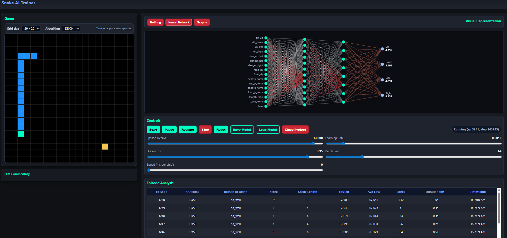
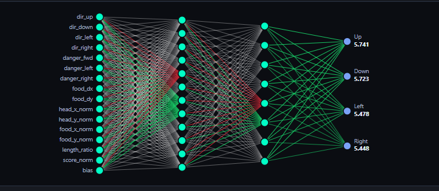
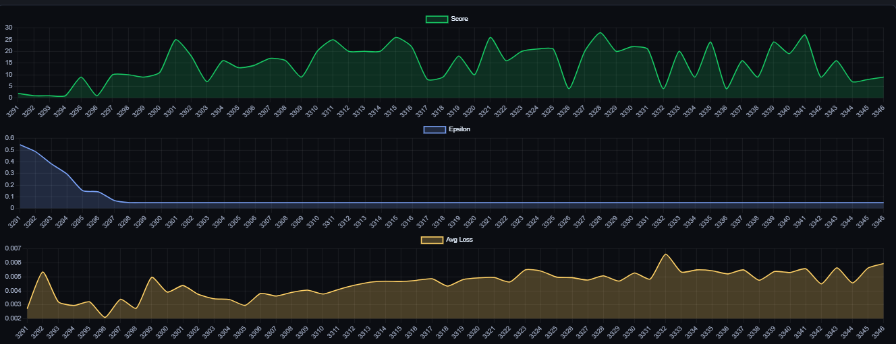
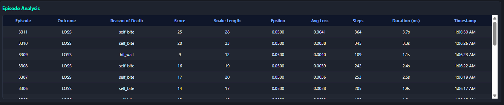
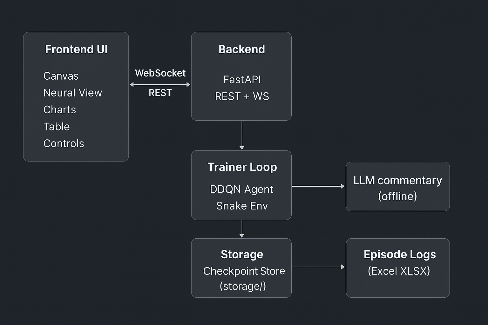

# 🐍 Snake AI Trainer

A polished reinforcement-learning playground for training a Snake agent (Double DQN) with a live, browser-based dashboard. The stack includes a FastAPI backend (REST + WebSocket), a responsive frontend with a canvas renderer, neural-network activity view, live charts, checkpointing, and optional offline LLM commentary.

---

## 📸 Preview

---

## Table of Contents

* Overview
* Features
* Architecture
* Requirements
* Setup & Run
* Configuration
* Using the App
* API Reference (REST + WebSocket)
* Reinforcement Learning Details
* Performance Tuning
* Files & Persistence
* Troubleshooting
* Roadmap
* Contributing
* License

---

## Overview

**Goal:** Provide an end-to-end, interactive environment for experimenting with value-based RL on Snake while observing the learning dynamics in real time.

**What you get:**

* A reproducible training loop (Double DQN with target network + replay buffer)
* A clean, dark UI for visualization and controls
* One-click save/load checkpoints
* Optional human-readable “commentary” via a local/offline LLM (can be hard-disabled)

---

## ✨ Features

### Training & Algorithms

* Double DQN (policy + target networks) with periodic target sync
* Replay buffer with random sampling
* ε-greedy exploration with live-tunable start/min/decay
* Live-tunable learning rate, discount factor (γ), batch size, step delay, and target update frequency

### Live Visualization

* Game canvas with Win/Loss overlays and death reasons
* Neural view: dense layers, Q-value readout, and activation “blinks”
* Charts: Score, Epsilon, Loss (auto-updating)
* Episode table: outcome, reason, score, snake length, ε, avg loss, steps, duration (ms), timestamp, algorithm, grid size

### Controls (in the browser)

* Start, Pause, Resume, Stop, Reset
* Save & Load checkpoint with an on-screen “Saving…” indicator
* Grid size selector (applies from the next episode)
* Algorithm selector (DDQN baseline)
* LLM commentary toggle (respects hard-disable)

### Storage & Logging

* Single checkpoint file per algorithm (in `storage/checkpoints/`)
* Batched episode logging to Excel (`storage/episodes/<algo>.xlsx`) with safe flushing on close

---

## 🧩 Architecture

* **Frontend (`/frontend`)**
  Static HTML/CSS/JS app served locally. Connects to REST for control and a WebSocket stream for frames/metrics/NN activations/commentary.
* **Backend (`/backend`)**
  FastAPI app exposing REST endpoints and a `/ws/stream` WebSocket. Orchestrates training, broadcasting UI events, saving checkpoints, and logging episodes.
* **Training (`/backend/train/loop.py`)**
  Trainer thread runs the environment, agent, optimization step, and emits UI events. Live-applies LR/γ updates, rebuilds env on grid change, and appends episode summaries.
* **Agent (`/backend/agent/ddqn.py`)**
  PyTorch models (policy + target), autocast safe training, activations captured for visualization.
* **Environment (`/backend/env/snake_env.py`)**
  Grid world with classic Snake rules; returns compact state/features (agent-side) and info dict for UI (outcome/reason).

---

## ✅ Requirements

* Python 3.10+
* Recent Chrome/Edge/Firefox/Safari
* (Optional) NVIDIA GPU + CUDA-enabled PyTorch for maximum training speed

---

## 🚀 Setup & Run

1. Install dependencies from `requirements.txt`.
2. Launch the app using `start.py`. Examples:

   * Open the frontend automatically: `python start.py --open`
   * Disable LLM commentary entirely: `python start.py --open --nollm`
   * Customize ports/hosts (if needed): `--front-port 8080 --api-port 5000`
3. The launcher serves:

   * Frontend at `http://127.0.0.1:8080`
   * Backend at `http://127.0.0.1:5000`

*If you need a bare uvicorn run, a helper PowerShell script is included (`run_uvicorn.ps1`).*

---

## 🛠️ Configuration

You can set environment variables (or edit `backend/config.py`) before launching.

**Core runtime**

* `REQUIRE_CUDA` (0/1): if 1 and CUDA is unavailable, startup fails; otherwise it falls back to CPU.

**Game board**

* `BOARD_WIDTH`, `BOARD_HEIGHT`: grid size (default 20×20).
* `WIN_LENGTH`: snake length to trigger Win (defaults to `width*height - 1`).

**Training defaults**

* `DEFAULT_GAMMA` (e.g., 0.95)
* `DEFAULT_LR` (e.g., 0.001)
* `DEFAULT_BATCH` (e.g., 64)
* `DEFAULT_MAX_EPISODES` (0 = endless)
* `DEFAULT_MAX_STEPS`
* `DEFAULT_EPS_START`, `DEFAULT_EPS_MIN`, `DEFAULT_EPS_DECAY`
* `TARGET_UPDATE_FREQ`
* `STEP_DELAY_MS` (render pacing; 0 for fastest)

**Checkpoints & logs**

* `CHECKPOINT_DIR` (default `storage/checkpoints`)
* `EPISODES_DIR` (default `storage/episodes`)
* `EPISODES_WRITE_BATCH` (default 100; buffered Excel writes)

**LLM commentary**

* `LLM_ENABLED` (0/1)
* `LLM_HARD_DISABLE` (0/1)
* `LLM_BACKEND` (e.g., “hf”)
* `LLM_MODEL_HF_ID`, `LLM_LOCAL_DIR`, `LLM_MAX_TOKENS`

*Launch flag `--nollm` sets `LLM_ENABLED=0` and `LLM_HARD_DISABLE=1` so it cannot be re-enabled mid-run.*

---

## 🖥️ Using the App

**Views**

* **None**: minimal rendering (fastest)
* **Neural**: shows dense layer activations & Q-values
* **Graphs**: Score/Epsilon/Loss time-series

**Controls**

* Start / Pause / Resume / Stop / Reset
* Grid Size (applies next episode)
* Algorithm (DDQN baseline)
* Sliders: ε-decay, LR, γ, Batch Size, Speed (ms/step)
* Save / Load checkpoint (watch the “Saving…” pill)

**Episode Table**

* Columns: episode, outcome, reason, score, snake\_length, epsilon, avg\_loss, steps, duration\_ms, timestamp, algorithm, grid\_w, grid\_h

---

## 🔌 API Reference

### REST (base: `http://127.0.0.1:5000`)

* **GET `/api/config`** → returns the current parameters (training, board, ε, LLM, etc.).
* **POST `/api/config`** → replace/update configuration (full or partial patch).
* **POST `/api/update_config`** → alias for partial updates (live-applies LR/γ; rebuilds env on board change; updates ε schedule immediately if `start`/`min` change).
* **POST `/api/start`** → load checkpoint (if present), re-apply UI config, start training.
* **POST `/api/pause`** → pause and save checkpoint (emits `saving_*` events).
* **POST `/api/resume`** → resume training.
* **POST `/api/stop`** → stop loop.
* **POST `/api/reset`** → reset env/counters.
* **POST `/api/save`** → save checkpoint (signals saving start/finish).
* **POST `/api/load`** → load checkpoint; response `{ ok: true/false }`.
* **POST `/api/close`** → pause+save, flush episode log, announce `server_closing`, close websockets, and gracefully shut down.

### WebSocket (`ws://127.0.0.1:5000/ws/stream`)

Messages are JSON objects with a `type` field. Notable event types:

* `state_frame` – compressed state/frame payload for canvas render
* `nn_activations` – dense layer activations & Q-values for the neural view
* `metrics_tick` – incremental metrics for charts
* `episode_summary` – per-episode row for the table & Excel log
* `game_over` – end-of-episode with reason
* `saving_started` / `saving_finished` / `saving_failed` – checkpoint lifecycle
* `checkpoint_loaded` – after successful load
* `config_applied` – confirmation of new config
* `board_changed` – grid dimensions updated
* `llm_comment` – optional commentary messages
* `run_stopped` / `server_closing` – lifecycle signals

---

## 🤖 Reinforcement Learning Details

**State & Actions**

* Actions: Up, Down, Left, Right.
* State: compact feature vector assembled agent-side (position/direction/food context, collision proximity, etc.) to keep network small and training fast.

**Rewards (typical shaping)**

* Small living penalty to encourage progress
* Positive reward for eating food
* Negative reward for wall/self collision
* Win when `snake_length ≥ WIN_LENGTH`

**Agent**

* PolicyNet: two fully-connected hidden layers (ReLU) → Q-values for 4 actions
* TargetNet: periodically synced to stabilize training
* Loss: smooth L1 (Huber) or MSE, optimized via Adam
* Exploration: ε-greedy with configurable start/min/decay

---

## ⚙️ Performance Tuning

* Set **Speed (ms/step) = 0** for the fastest loop.
* Switch to **None** or **Graphs** view to reduce canvas work.
* Use a **CUDA** build of PyTorch on supported GPUs.
* Increase **batch size** if the GPU has headroom; decrease if you see instability.
* Adjust **TARGET\_UPDATE\_FREQ** (higher = more stable targets; lower = faster reactivity).
* Tune **ε-decay**: start high for exploration, but decay to a meaningful minimum as performance improves.

---

## 🗂️ Files & Persistence

* **Checkpoints**: `storage/checkpoints/<algo>.ckpt` (single file per algorithm).
* **Episode Logs**: `storage/episodes/<algo>.xlsx` (headers written once; new rows appended in batches).
* **Frontend**: `/frontend/index.html`, `/frontend/script.js`, `/frontend/style.css`.
* **Backend**: `/backend/app.py` (API), `/backend/train/loop.py` (trainer), `/backend/agent/ddqn.py`, `/backend/env/snake_env.py`, `/backend/storage/*` (checkpoint helpers).
* **Launcher**: `start.py` (serves frontend, runs backend; supports `--open`, `--nollm`, ports/hosts).

Add repository visuals (badges, diagram images, GIFs) under `docs/images/`.

---

## 🧰 Troubleshooting

**The snake looks slow in the UI**

* Lower the step delay (Speed slider) toward 0.
* Switch view to **Graphs** or **None** to reduce rendering overhead.
* If training itself is slow, verify the PyTorch install is using GPU (if available).

**Episode table not updating**

* Ensure episodes are actually finishing (not paused).
* Check WebSocket connectivity in the browser dev tools (the `/ws/stream` should be connected).

**Save/Load issues**

* Confirm write permissions to `storage/checkpoints`.
* Wait for the “Saving…” pill to disappear before closing the app.

**Excel log not written**

* Directory `storage/episodes` is created on demand; check that the process can write to it.
* Logs are buffered; on close the app flushes remaining rows.

---

## 🗺️ Roadmap

* N-step returns and prioritized replay (optional)
* Alternate reward shapers & curricula
* Multi-env parallel sampling (for throughput)
* Expanded metrics (moving averages, episode bests)
* Richer neural visualization and attention to failure cases

---

## 🤝 Contributing

* Keep UX responsive and accessible; prefer non-blocking operations.
* Mirror any UI-visible changes in this README and add an entry to a `CHANGELOG.md`.
* Keep configuration centralized in `backend/config.py` and documented here.
* Style: clear variable names, minimal magic numbers, docstrings where behavior might be non-obvious.

---

## 📄 License

MIT License (see `LICENSE`).

---

## ℹ️ About

A compact, end-to-end RL playground for Snake, built to make “watch-it-learn” both intuitive and fun. Replace the image placeholders with your own screenshots to complete the presentation.
